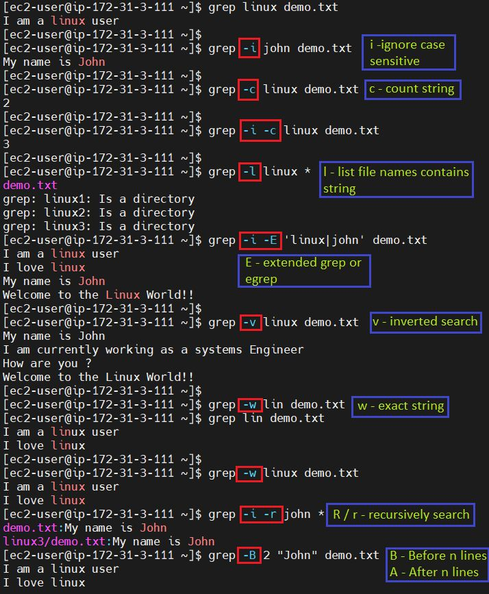

# Essential Commands


<details>

<summary><strong>Git Commit with a different date</strong></summary>

```sh
git commit -m "Nothing" --date="2020-09-18 19:00:05"
```

</details>

<details>

<summary>U<strong>pdate time from online</strong></summary>

```sh
sudo service ntp stop 
sudo ntpdate -s time.nist.gov 
sudo service ntp start
```

</details>

## Grep Commands

<figure><figcaption></figcaption></figure>


